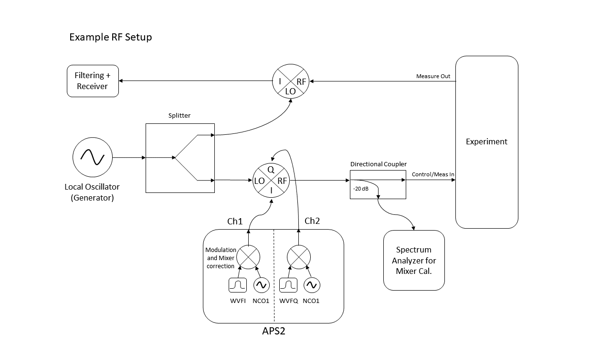

Experiment Setup
==================

The Arbitrary Pulse Sequencer 2 (APS2) modules operate with 1.2 GS/s DACs. Each card supports two output channels, typically used as the in-phase and quadrature for a single qubit. Qubit measurement and control frequencies are higher than the frequencies achievable from the output of the APS2 (does not support higher Nyquist zones). Consequently, it is necessary to mix the APS2 output with an RF local oscillator. A diagram of a typical experiment set up with an APS2 is provided below:

Examples in this documentation reference BBN's QGL v1.1.x (http://github.com/BBN-Q/QGL) and Auspex v0.4.x (https://github.com/BBN-Q/Auspex).

Further detail about the use of an APS2 in a qubit experiment can be found here: https://aip.scitation.org/doi/full/10.1063/1.5006525

Example .yml configuration files and an IPython notebook (*Single_Qubit_Characterization.ipynb*) can be found in the ``examples`` section of libaps2 (http://github.com/BBN-Q/libaps2).

YAML Setup
----------

Measure.yml
~~~~~~~~~~~

For an example declaration of an APS2 in the Channel library, look at *measure.yml*. Be sure to update the relevant directory paths in the file. In the example, we associate qubit Q1 with BBNAPS1 12 (measure) and BBNAPS2 12 (control). The ``12`` after the BBNAPS identifier specifies the use of channel 1 for in-phase control and channel 2 for quadrature control.  For measurement channels, one should provide a ``trigger`` output to pass to the digitizer card. This trigger will indicate when a measurement has begun so data collection can start.
Each APS2 includes a ``generator`` in the library. The generator is the Local Oscillator associated with the measure or control channel.
The ``autodyne_freq`` is the frequency with which the APS2 modulates each pulse. The APS2 can support up to two onboard NCO’s up to 600 MHz each (typically utilized at <200 MHz). The added feature of multiple NCO’s allows one APS2 card to drive *1:* I/Q modulation on two measurement frequencies (multiplexed readout) or *2:* both the single qubit and two-qubit control pulses. During qubit and cavity spectroscopy, the LO frequency is typically swept and the ``autodyne_freq`` is kept at zero. Once, the cavity and qubit frequency are settled upon, a modulation (10’s of MHz) is added to the APS2 such that f\ :sub:`m,c`\ = f\ :sub:`LO`\ + f\ :sub:`mod`\. f\ :sub:`m,c`\  is the targeted measure or control frequency and f\ :sub:`mod`\  is the added frequency calculated within the APS2. By utilizing a non-zero modulation, LO leakage is not directly resonant with the feature of interest.
The ``pulse_params`` are the actual parameters of the measure and control pulses. The pulses are scaled by the factors in the instruments.yml file to account for physical imperfections. A pulse from the APS2 will have a rising/falling edge given by the ``shape_fun`` parameter and run for a total duration given by the ``length`` parameter. Certain shapes require additional terms, for example the ``tanh`` function requires a ``sigma`` value which defines the rise time. Source code for these pulse shapes is in *QGL/QGL/PulseShapes.py*. For measure pulses, there is only one overall amplitude scale factor. For control pulses the user can specify and amplitude for :math:`\pi/2` and :math:`\pi` pulses (``pi2amp`` and ``piamp``). Auspex calibration routines (*cal.Pi2Calibration* and *cal.PiCalibration*) help precisely set these control parameters.
The ``cutoff`` parameter should be set to 2.0. And finally, the ``gain`` parameter is wholly a dummy term. It is meant to help users track the added physical attenuation in line with the output.
``Markers`` which will be used in QGL are nicknamed in the measure.yml file. Markers are the four digital output channels from the APS2. In this case, we have defined ``mark_M3`` which corresponds to the third physical marker on BBNAPS2.  Each physical marker should be defined in instruments.yml.

Instruments.yml
~~~~~~~~~~~~~~~

APS2
~~~~~~~~~~~~~~~
~~~~~~~~~~~~~~~

All physical instruments are described in *instruments.yml*. The two APS2s referenced in the measure.yml file are declared here. Each APS2 is associated with its IP address, identified as a master or slave, and assigned various pulse parameters. One should also declare physical ``markers``. If a TDM is in use as the system trigger, it also enumerated. Further detail on APS2 triggering is provided in the next section.
For an APS2, the ``tx_channels`` field is where one specifies the output amplitude, phase and offset for the APS2. The actual amplitude emitted is the product the amplitude in the qubit declaration (measure.yml), and the ``amplitude`` field for each output channel. Anecdotally, the APS2 output power is linear (doubling the amplitude results in 3 dB output power increase) below a total scale factor of 0.7.
The ``offset``, ``amp_factor``, and ``phase_skew`` fields are related to mixer imperfections. These three parameters are typically tuned using Mixer Calibration routines, combined with the Spectrum Analyzer measurements depicted in the figure above. Further discussion of mixer calibration is provided below.

Markers
~~~~~~~~~~~~~~~
~~~~~~~~~~~~~~~

There are four markers associated with each APS2 (typically 12m1-4). They can be activated in two ways. The first way is through the YAML files. In the example measure.yml provided, for BBNAPS1, marker 2 is declared as the measurement trigger. The properties in the instruments.yml dictate that it will wait 150 ns after the measure pulse begins and emit a pulse of 200 ns.
The second way that markers are activated is through the QGL command *TRIG*. Given the marker declared above, utilizing QGL, one could declare *m3 = MarkerFactory(“mark_M3”)*. Then the command *TRIG(m3,100e-9)*, would activate the marker for 100 ns within a QGL gate sequence. This utilization of markers can be a tool in debugging the APS2 output on an oscilloscope.

Generators
~~~~~~~~~~~~~~~
~~~~~~~~~~~~~~~

Generators (LO’s) are also enumerated in the instruments.yml file (see ``Microwave Sources``). In the example, the measurement of Q1 is associated with ``Autodyne M1`` which is a Vaunix Labbrick signal generator. The LO for control pulses on Q1 is created with ``q1source``. This is physically generated via an AgilentN5183A. A commented-out template for a Holzworth RF source is also provided (``AutodyneM2``). Generators are typically powered in the region specified by the IQ mixer (e.g. ~13 dBm for Marki Microwave IQ-0307). Each generator should be locked to an external ``reference``, usually 10 MHz, to perform repeatable phase coherent experiments.

Triggering
----------

Following the trigger documentation: 'The APS2 supports four different types of triggers. The internal mode generates triggers on a programmable interval between 6.66ns and 14s. The external mode listens for triggers on the front-panel SMA “trigger input” port. In this mode, the APS2 is triggered on the rising edge of a 1-5V signal. The system trigger accepts triggers on the SATA input port from the APS2 Trigger Distribution Module (TDM). Finally, the software mode allows the user to trigger the APS2 via the host computer with the trigger() API method'. Here we will focus on two modes: system triggering and master/slave triggering.

System
~~~~~~~~~~~~~~~
To implement system triggering, set all APS2 ``trigger_source`` to ``system`` (and ``master`` to false). A TDM must be enabled, with its ``trigger_source`` set to Internal. In this way, the TDM will generate a trigger pulse every ``trigger_interval`` seconds. This pulse is distributed to the APS2 units via the SATA interconnects, at which point the APS2 sequencers begin. This method is preferable if more than few APS2 units are in use. The SATA distribution system is far easier than connecting a single APS2 master marker to many slaves.

Master/Slave
~~~~~~~~~~~~~~~

Instead, if the APS2 is to act as the ``master``, one should specify the ``slave_trig`` marker. The master should be set to an Internal ``trigger_source``. All the slaves should have an External ``trigger_source``. The master will then generate a pulse every ``trigger_interval`` seconds on its ``slave_trig`` line. This marker should be plugged into all the slave APS2 units on their trigger input port. Note, the output of the marker cannot support more than a few APS2 units without amplification.
In all cases the ``trigger_interval`` on the trigger generator should be much longer than an experiment, to allow for qubit relaxation.

Mixer Calibration Routines
--------------------------

There are imperfections that can result from the mix-up process with an LO. In particular, there is leakage at the LO frequency (assuming non-zero I/Q frequency), gain imbalance in the I and Q channels, and phase imbalance in the I and Q channels. We seek to correct these with the mixer calibration routines: `QubitExpFactory.calibrate_mixer`, found in `Auspex mixer_calibration.py`. The correction schemes are based upon Analog Devices `AN-1039
<http://www.analog.com/media/en/technical-documentation/application-notes/AN-1039.pdf>`_. The routines utilize a BBN Spectrum analyzer (SA in intstruments.yml) which requires its own local oscillator (SALO). By tuning the DC offset on the mixer, we can suppress leakage at the LO frequency. Similarly, by adjusting a constant phase (``phase_skew``) to all waveforms, we can correct for I/Q phase imbalance in the mixer. And by rescaling the I and Q relative amplitudes, we can correct for a gain mismatch in the two sides of the IQ mixer. Sweeps of these parameters are performed and the returned data from the spectrum analyzer is fitted to determine optimal parameters. The scripts will then update both of the channel offsets, phase skew and amplitude factor in instruments.yml. The APS2 is responsible for performing the correct on-board 2x2 matrix multiplication and offset addition to apply these fixes.
