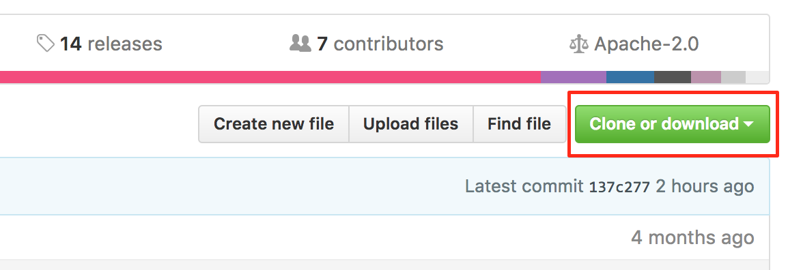
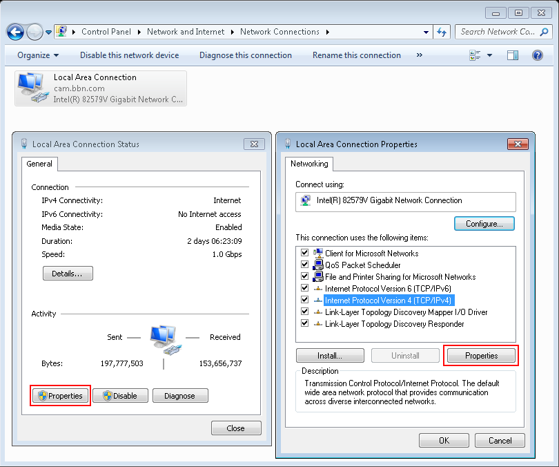
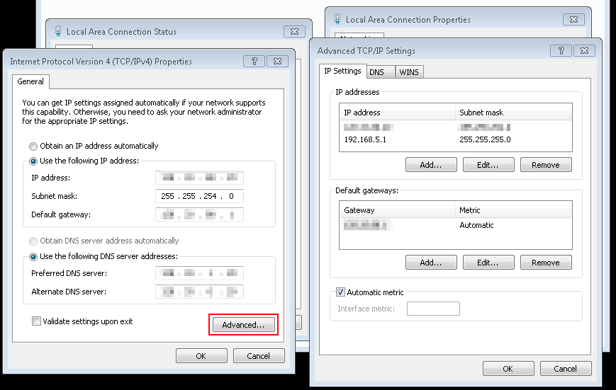

Installation Guide
==================

Hardware
--------

The BBN APS2 system contains one or more analog output modules and an trigger
distribution module in an enclosure that supplies power to each module. Up to 9
analog modules may be installed in a single 19" 8U enclosure, providing 18
analog output channels. Installing a new module only requires plugging it into a
free slot of a powered-off system, then optionally connecting a SATA cable from
the new APS module to the trigger module. The SATA interface is required to send
signals between the APS and TDM modules.

Each module in an APS2 system acts as an independent network endpoint. The
modules communicate with a host computer via a UDP/TCP interface over 1GigE. The
APS2 will not auto-negotiate down to 100Mb or 10Mb so you must connect via a
gigabit switch and appropriate patch cable (cat 5e or cat 6). To ensure
high-bandwidth throughput, it is important that the APS2 and the host computer
are not separated by too many network hops. If possible, locate the host and
APS2 on a common switch or router [#f1]_.

While the APS2 can run in a standalone clock configuration, to achieve
synchronous output from multiple modules requires supplying a 10 MHz (+7 dBm)
external reference (square wave or sine wave) to *each* module at the
corresponding front panel input. Multiple devices are then synchronized with a
phase-synchronous external trigger delivered to each module, or by using the
TDM to generate a system trigger.

.. _software-installation:

Software
--------

The APS2 control interface is provided by a C-API shared library (libaps2) as as
well as wrappers in common scientific programming languages (python, MATLAB, and
Julia). Pre-built binaries for the shared library are available for several
platforms, including Win64, linux, and macOS. A demonstration script and several
example sequence files are available in the libaps2 source code repository.
Therefore, we recommend that users download the latest version of the source
from GitHub (http://github.com/BBN-Q/libaps2).

	Download a ZIP file with the latest libaps2 source code by clicking on the
	link shown above.

The GitHub website provides a link to download a zip file with the latest
snapshot of the source repository. Git users may instead clone the repo with::

	git clone https://github.com/BBN-Q/libaps2.git

Using git has the advantage that users may easily upgrade to future libaps2
releases with `git pull`. Description of the source repository files is
available in the :ref:`file-list` section.

Installation via conda
~~~~~~~~~~~~~~~~~~~~~~

Users of the Anaconda python distribution can install libaps2 via
`conda`::

	conda install -c bbn-q libaps2

This command will install the libaps2 shared library and libaps2 python wrapper
into your Anaconda path (~/anaconda3/lib on posix-systems, or
C:\\Users\\%USERNAME%\\Anaconda3\\Library on windows) such that it can be easily
loaded by other programs. To verify that it worked, launch an ipython REPL and
try::

	In [1]: import libpaps2

If that command runs without errors, the install completed successfully. If you
encounter errors, verify that the Anaconda library folder is on your PATH.

Installation from source
~~~~~~~~~~~~~~~~~~~~~~~~

Users that need ultimate control over the libaps2 dependencies will want to
build the shared library from source. Follow the instructions in the README to
build the binaries. Our cmake scripts include an `install` target which will
install the binaries in appropriate locations on your system with::

	make install

The libaps2 python wrapper can be installed separately with::

	cd src/python
	pip install .

To verify successful installation, try importing libaps2 into a python console,
as shown above.

Manual installation
~~~~~~~~~~~~~~~~~~~

A third option is to download pre-built binaries from the "Releases" tab on
GitHub (http://github.com/BBN-Q/libaps2/releases). Download the archive
corresponding to your operating system and extract the files. On posix-systems,
copy the contents of the archive to corresponding locations in `/usr/local`
(i.e. copy files from `lib/` to `/usr/local/lib` and `include/` to
`/usr/local/include`). On windows, add the `bin` folder to the PATH variable, or
copy `libaps2.dll` to `C:\\windows\system32`.

.. _file-list:

File list
~~~~~~~~~~~~~

The releases follow a directory structure that corresponds to the git
repository.

* `examples` - Example sequence and waveform files
	- `aps2_demo.m` - Matlab demonstration script
	- `aps2_demo.py` - Python demonstration script
		+ a full scale ramp;
		+ gaussian pulses from 256 samples down to 8 samples with 10ns gaps;
		+ square wave from 256 down to 8 samples with 10ns gaps;
		+ wfB.dat is negative wfA.dat.
	- `cpmg.h5` - a CPMG sequence `Y90 - ( delay - X180 - delay)^n - Y90m` with n = [4, 8, 16, 32, 64]
	- `instr_prefetch.h5` - demonstration of subroutine prefetching
	- `ramsey.h5` - a Ramsey sequence `X90 - delay - X90m`
	- `ramsey_tppi.h5` - a Ramsey experiment with the second pulse phase modulated by Time Proportional Phase Increment using the `PHASE_OFFSET` instruction
	- `ramsey_tppi_ssb.h5`- same as `ramsey_tppi` but with SSB modulation of the pulses using on-board modulation.
	- `ramsey_slipped.h5` - a Ramsey pattern but with the markers slipped by one sample to show the marker resolution and jitter.
	- `wfA.dat`/`wfB.dat` - test waveform patterns for `play_waveform` executable as signed integers one sample per line:
* `src` - the source code
	- `src/lib` - the shared library. ``libaps2.h`` contains the public API definitions.
	- `src/matlab` - Matlab bindings to libaps2
	- `src/julia` - Julia bindings to libaps2
	- `src/python` - python bindings to libaps2
	- `src/util` - test and utility command line programs. See below for description.
	- `src/C++` - C++ command line programs to play waveforms and sequences.
	- `src/wireshark` - lua dissector for sniffing APS2 packets.
* `build` - compiled shared library and executable programs
	- Shared library
		+ `libaps2.dll` - the main shared library
	- Command line programs
		+ `aps2_play_waveform.exe` - command line program to play a single waveform on the analog channels.
		+ `aps2_play_sequence.exe` - command line program to play a HDF5 sequence file.
	- Command line utilities
		+ `aps2_enumerate.exe` - get a list of APS2 modules visible on the network subnet.
		+ `aps2_program.exe` - update the firmware.  See `Firmware Updates`_.
		+ `aps2_flash.exe` - update IP/DHCP and MAC addresses and the boot chip configuration sequence.
		+ `aps2_reset.exe` - reset an APS2.
	- Self-test programs
		+ `aps2_run_tests.exe` - runs the unit test suite

Writing Sequences
~~~~~~~~~~~~~~~~~~

The BBN APS2 has advanced sequencing capabilities. Fully taking advantage of
these capabilities may require use of higher-level languages which can be
'compiled down' into sequence instructions. BBN has produced one such
language, called Quantum Gate Language (QGL, http://github.com/BBN-Q/QGL), as
well as a parameter management GUI in the PyQLab suite
(http://github.com/BBN-Q/PyQLab). We encourage end-users to explore using QGL
for creating pulse sequences. You may also find the sequence file export code
to be a useful template when developing your own libraries. A detailed
instruction format specification can be found in the :ref:`instruction-spec`
section.

Networking Setup
----------------

Once the APS2 has been powered on, the user may assign static IP addresses to
each module. By default, the APS2 modules will have addresses on the 192.168.2.X
subnet (e.g. the leftmost module in the system will have the address
192.168.2.2, and increase sequentially left-to-right). The ``enumerate()``
method in libaps2 may be used to find APS2 modules on your current subnet.
Another method, ``set_ip_addr()`` or the ``flash`` utility may be used to
program new IP addresses. Since the APS2 modules will respond to any valid
packet on its port, we recommend placing the APS2 system on a private network,
or behind a firewall. The APS2 can also be setup to obtain a dynamically
assigned IP address from a DHCP server.  The ``flash`` utility can be used to
toggle between static and dynamic but the APS2 must be reset or power cycled for
the setting to take effect. If the DHCP look-up fails the system will fall back
to its static IP address.

The control computer must be on the same subnet as the APS2 to respond to
returning packets. Most operating systems allow multiple IP addresses to coexist
on the same network card so the control computer can add a virtual IP on the
APS2 subnet.

Windows
~~~~~~~~~~~~~~

Under the Control Panel - Network and Internet - Network Connections click on
the "Local Area Connection" and then properties to change the adapter settings.
Then set the properties of the TCP/IPv4 interface.

	**Step 1** accessing the IPv4 settings for the network interface.

Then under the Advanced tab it will be possible to add additional IP addresses.
Unfortunately, Windows does not support multiple IP addresses with DHCP so a
static address is required for the main network.

	**Step 2** Adding addition IP addresses for the network interface.

Linux
~~~~~~~~~~~~~~~

Temporary IP addresses can be obtained by adding additional ethernet
interfaces using the `ip` command::

	sudo ip addr add 192.168.2.29/24 dev eth0

A more permanent solution would involve editing the network interfaces file,
e.g. ``/etc/network/interfaces``.

OS X
~~~~~~~~~~~~

In the System Preferences pane under Networking use the "Plus" button to add an
interface.

Firmware Updates
-------------------------

BBN releases periodic firmware updates with bug-fixes and enhancements.  These
can be loaded onto the APS2 modules using the ``aps2_program`` executable::

	./aps2_program
	BBN AP2 Firmware Programming Executable
	USAGE: program [options]

	Options:
	  --help      Print usage and exit.
	  --bitFile   Path to firmware bitfile.
	  --ipAddr    IP address of unit to program (optional).
	  --progMode  (optional) Where to program firmware DRAM/EPROM/BACKUP (optional).
	  --logLevel  (optional) Logging level level to print (optional; default=2/INFO).

	Examples:
	  program --bitFile=/path/to/bitfile (all other options will be prompted for)
	  program --bitFile=/path/to/bitfile --ipAddr=192.168.2.2 --progMode=DRAM

The executable will prompt the user for IP address and programming mode. The
APS2 can boot from multiple locations: volatile DRAM; non-volatile flash or if
all else fails a master backup in flash. The DRAM storage takes only a few
seconds to program and is used for temporary booting for testing purposes. It
will be lost on a power cycle. Once you are happy there are no issues with the
new bitfile you can program it to the flash memory so the module will boot from
the new firmware on a power cycle. This process involves erasing, writing and
verifying and takes several minutes. The backup firmware should only be
programmed in the rare case BBN releases an update to the backup image.  Should
something catastrophic happen during programming (unplugging the ethernet cable)
the module may drop to the backup image which has a fixed IP of 192.168.2.123.

.. rubric:: Footnotes

.. [#f1] The APS2 typically uses static self-assigned IP addresses and should
	 ideally be behind the same router as the control computer.
