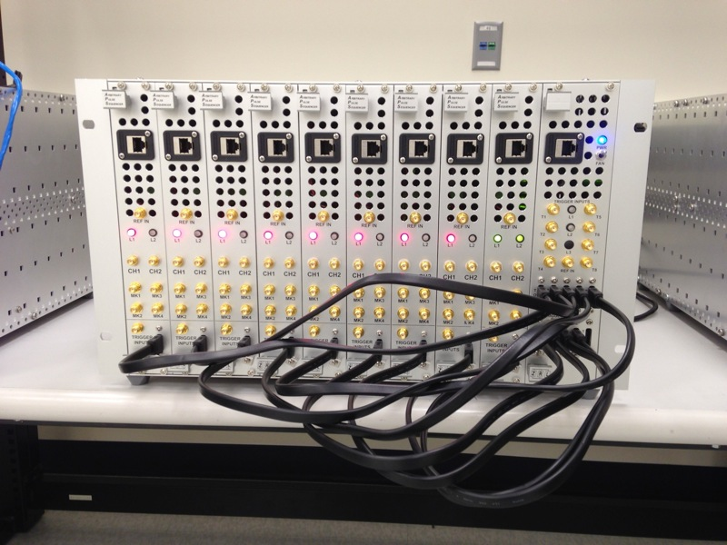

Hardware Specifications
=======================

The BBN Arbitrary Pulse Sequencer 2 (APS2) is a modular system providing up to
18 channels of analog waveform generation with a maximum output rate of 1.2
GS/s and 14-bits of vertical resolution. Each module in an APS2 system
provides two analog outputs, DC coupled into a fixed +/- 1V range, and four
digital outputs (1.5 V) for triggering other equipment. Each APS2 module has 1
GB of DDR3 SDRAM for waveform and sequence storage, which is enough for over
64 million sequence instructions. A low-latency cache allows for fast access
to 128K waveform samples. Each module can be independently triggered for
sophisticated waveform scenarios.

The digital and analog circuits have been carefully engineered to provide
extremely low-noise analog performance, resulting in a noise spectral density
that is orders of magnitude lower than competing products, as shown in
:ref:`Noise Comparison <noise-figure>`.

.. _noise-figure:

.. figure:: images/aps-ii-tek-noise-comparison.*
	:figwidth: 60%

	**Comparison of AWG output noise** Output noise power versus frequency for
	the Tektronix AWG5014, Innovative Integration X6-1000M, and BBN APS. The
	APS's linear power supplies and low-noise output amplifier lead to signficant
	improvements in the noise performance. The II X6 is significantly better
	than the Tek5014, but suffers from resonances in the noise spectrum because
	it is in a host PC environment.

Detailed Specifications
-----------------------

	**BBN APS2 front panel** The front panel of the APS has two analog outputs,
	4 marker outputs, a trigger input, two SATA ports, a 1 GigE port, a
	10 MHz reference input and two status LEDs.

========================  ==============================================================
Analog channels           two 14-bit 1.2 GS/s outputs per module
Digital channels          four 1.5V outputs per module
Analog Jitter             7.5ps RMS
Digital Jitter            5ps RMS
Rise/fall time            2ns
Settling time             2ns to 10%, 10ns to 1%
Trigger modes             Internal, external, or software triggering
Ext. trigger input        1 V minimum into 50 Ω, 5 V maximum; triggered on *rising* edge
Waveform cache            128K samples
Sequence memory           64M instructions
Min instruction duration  8 samples
Max instruction duration  8M samples (~7ms at 1.2GS/s)
Max loop repeats          65,536
========================  ==============================================================

Communications Interface
------------------------

The APS2 communicates with a host PC via the UDP protocol over 1GigE. The
current APS2 firmware requires a fixed IPv4 address. Instructions for setting
the APS2 IP address are contained in the :ref:`software-installation` section.
Use of the UDP protocol allows for a large-througput link from the host PC to
the APS2; however, it does not natively support error checking of the sent
data. The libaps2 driver adds some error-checking and packet resending to UDP,
but it is recommended not place too many network hops between the host PC and
the APS2.

Status LED's
------------------------

The L1 and L2 LEDs provide status indicators for the communication (L1)
and sequencing (L2) firmware components.

L1:

* green breathing - no ethernet connection;
* green blinks - receiving or transmitting an ethernet packet;
* red - fatal communication error. Power cycle the module to restore connectivity. 

L2:

* dark - idle;
* solid green - playback enabled and outputing sequences;
* green breathing - playback enabled but no trigger received in the past 100ms;
* red - fatal cache controller error. Power cycle the module to restore playback
  functionality.
